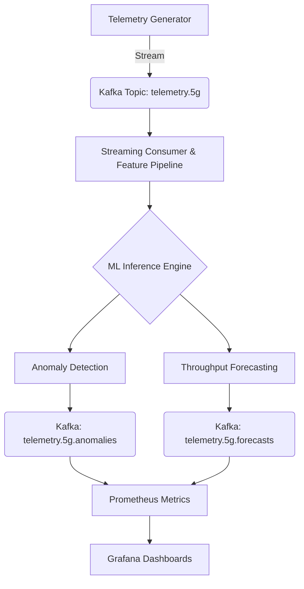

# AI-Driven 5G Network Observability & Autonomous Analytics Platform

[](https://www.python.org/)
[](https://kafka.apache.org/)
[](https://prometheus.io/)
[](https://mlflow.org/)

A real-time telemetry analytics pipeline designed for detecting anomalies and forecasting performance in 5G packet core networks. This platform simulates telecom network traffic and applies streaming machine learning to enable autonomous monitoring, fault detection, and proactive capacity planning.

---

## Overview

Modern 5G networks generate massive telemetry across packet core components (AMF, SMF, UPF). Detecting congestion, packet loss, and latency degradation in real time is critical for maintaining Service Level Agreements (SLAs) and Quality of Service (QoS).

This architecture demonstrates an end-to-end AIOps pipeline that:
* **Streams** network telemetry in real-time via Kafka.
* **Detects** anomalies (RAN congestion, transport loss) using Isolation Forests.
* **Forecasts** throughput trends using Multi-horizon LightGBM.
* **Visualizes** network health through Prometheus and Grafana dashboards.

---

## Key Capabilities

### 🔍 Real-Time Anomaly Detection
Uses **Isolation Forest** to identify network irregularities including:
* RAN congestion & PRB exhaustion.
* Transport layer packet loss.
* Sudden latency spikes & performance degradation.

### Throughput Forecasting
A **Multi-horizon LightGBM** model predicts future throughput trends (1, 3, and 12-step horizons), enabling proactive scaling and capacity management.

### Network Observability
Integrated **Prometheus** metrics track:
* Telemetry ingestion rates.
* Total anomalies detected vs. normal traffic.
* Inference latency and model performance.
* Real-time anomaly rate trends.

### Streaming Feature Engineering
* Generation of lag features on the fly.
* Rolling windows for mean and volatility analysis.
* Real-time windowed telemetry transformations.

---

## Architecture




### Tech Stack
* **Streaming:** Apache Kafka, Docker
* **Machine Learning:** Scikit-learn (Isolation Forest), LightGBM
* **Observability:** Prometheus, Grafana
* **Experiment Tracking:** MLflow
* **Data Processing:** Pandas, NumPy

## Project Structure
```text
5g-anomaly-forecast/
├── configs/            # Infrastructure & Model configurations
├── data/               # Local data storage
├── artifacts/          # Serialized models (PKL/Joblib)
├── src/
│   ├── generate/       # Telemetry generator & Kafka producer
│   ├── features/       # Streaming feature engineering logic
│   ├── train/          # Model training scripts
│   ├── infer/          # Real-time inference consumers
│   ├── monitoring/     # Prometheus metric definitions
│   └── utils/          # Shared helper functions
├── docker-compose.yml  # Kafka, Prometheus, Grafana, MLflow setup
└── README.md
```

---

### 5. Getting Started (Setup Guide)

## Getting Started

### 1. Start Infrastructure
Launch the core services (Kafka, MLflow, Prometheus, Grafana):

```bash
docker compose up -d

```
Services:
* Kafka → localhost:9092
* MLflow → http://localhost:5001
* Prometheus → http://localhost:9090
* Grafana → http://localhost:3000

### 2. Train models

```bash
python -m src.train.train_anomaly
python -m src.train.train_forecast

```
### 3. Start real-time inference

```bash
python -m src.infer.consumer_infer

```
### 4. Generate telemetry stream

```bash
python -m src.infer.consumer_infer

```

---

### 6. Example Output & Author Info
##  Example Output

**Forecast Message:**
```json
{
  "gnb_id": "gnb_003",
  "target": "dl_throughput_mbps",
  "horizon_preds": {
    "1": 69.1,
    "3": 67.7,
    "12": 68.2
  }
}
```

**Anomaly Message:**
```json
{
  "gnb_id": "gnb_003",
  "scenario": "transport_loss",
  "anomaly": 1,
  "pkt_loss_pct": 2.75
}
```
---

## Observability Metrics
* Prometheus exposes:
** events_consumed_total
** anomalies_found_total
** inference_latency_seconds
** anomaly_rate_recent
** These metrics enable real-time network health monitoring.
---
## Use Cases
* ✔ Telecom network monitoring
* ✔ Autonomous network operations (AIOps)
* ✔ Capacity planning & forecasting
* ✔ Fault detection & reliability engineering
* ✔ Network observability pipelines
---
## Future Enhancements
* Integrate real telecom datasets
* Deep learning forecasting (LSTM / TFT)
* Drift detection & automated retraining
* Kubernetes deployment & autoscaling
* Alerting via Slack / PagerDuty
---
## Author
* Vaibhav Kejriwal
* Data Engineer | Telecom Analytics | ML Systems
---
## Why This Project Matters
* 5G and cloud-native networks require intelligent observability systems.
* This project demonstrates how streaming ML + telemetry analytics can enable autonomous, self-healing network operations.
---
